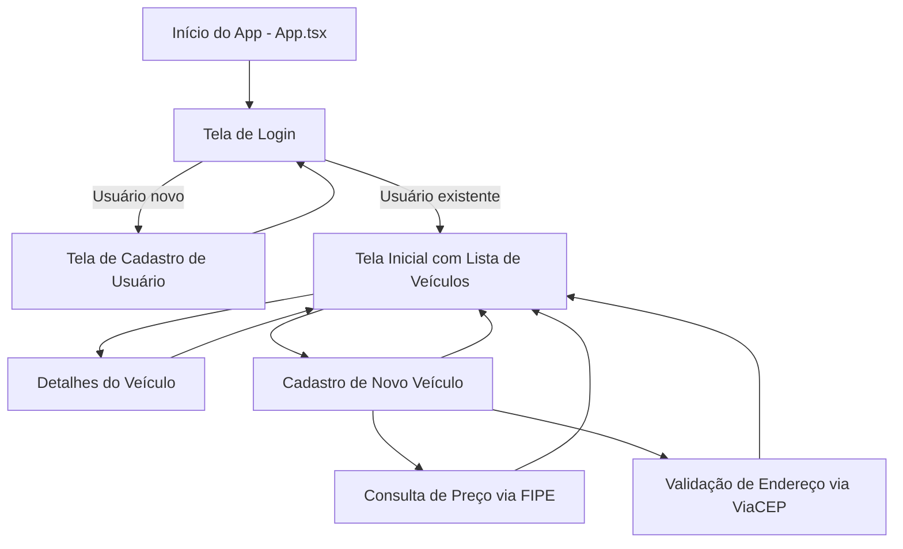

# KarsIV - Aplicativo de Venda de Veículos

Repositório do projeto completo em React Native, focado em venda de carros e motos, com funcionalidades inspiradas em plataformas como WebMotors.

**Repositório GitHub:** [https://github.com/Tteumelo/KarsIV](https://github.com/Tteumelo/KarsIV)

---

## Código-Fonte

### Estrutura do Projeto

- **React Native + Expo SDK**
- **Navegação**: Implementada com React Navigation (Stack Navigator)
- **Gerenciamento de Estado**: Hooks (`useState`, `useEffect`) e Context API
- **APIs externas integradas**:
  - **ViaCEP**: busca de endereço via CEP
  - **Tabela FIPE**: busca de preços de veículos
- **Recursos Nativos**:
  - Imagem de veículos com upload local
  - Layout responsivo
- **Organização modularizada**:
  - `/screens`: telas da aplicação
  - `/components`: componentes reutilizáveis
  - `/services`: integração com APIs
  - `/types`: definições TypeScript

---

## Testes

### Estrutura de Testes

- Testes unitários básicos em funções e hooks
- Testes manuais de funcionalidades principais:
  - Cadastro de usuário e veículo
  - Busca de endereço e preço de veículo
  - Navegação entre telas e persistência de dados

### Problemas e Soluções

- Erros de compilação corrigidos com alinhamento das versões de dependências
- Conflitos de dependência resolvidos com `expo install`

---

## Manual de Uso

### Instruções de Instalação

```bash
# Clone o repositório
git clone https://github.com/Tteumelo/KarsIV
cd KarsIV

# Instale as dependências
npm install

# Rode no ambiente Expo
npx expo start
```

### Principais Funcionalidades

- Login e Cadastro de usuários
- Cadastro de veículos com imagem
- Tela inicial com listagem de carros (estilo WebMotors)
- Tela de detalhes com informações e preços via FIPE
- Navegação entre telas via menu
- Animações básicas e navegação fluida
- Busca de endereço com validação de CEP (ViaCEP)

---

## Dependências Principais

- `react-native`
- `expo`
- `react-navigation`
- `axios`
- `firebase` (versão atualizada)
- `@react-native-async-storage/async-storage`

Use `npx expo install` para garantir versões compatíveis com o SDK atual.

---

## Arquitetura e Estrutura do Código

```bash
KarsIV/
├── App.tsx
├── app.json
├── package.json
├── /src
    ├── /screens
    ├── /components
    ├── /services
    ├── /types
    ├── /config
```

- **App.tsx**: ponto de entrada
- **app.json**: configurações Expo (sem `entryPoint`)
- **src/**: organização por responsabilidade

### Fluxograma de Funcionamento



---

## Relatório de Testes

### Cenários Testados

- Cadastro de usuário com e-mail inválido
- Busca de CEP inexistente
- Cadastro de veículo com campos obrigatórios vazios
- Navegação entre login > cadastro > listagem > detalhes
- Consulta de preço na FIPE com tipo e modelo não cadastrados

### Resultados Esperados x Obtidos

- Mensagens de erro exibidas corretamente
- Navegação fluida entre telas
- Dados persistidos entre mudança de telas
- Respostas apropriadas de API para erros comuns

### Problemas Corrigidos

- Erros de dependência com `react-native` e `expo`
- Configuração de plugins `expo-root-project`
- Remoção de `getReactNativePersistence` e uso atualizado do Firebase
- Correções na renderização da tela inicial e detalhes dos veículos

---

**Desenvolvido por:** Matheus de Melo e Gabriel Tolentino

