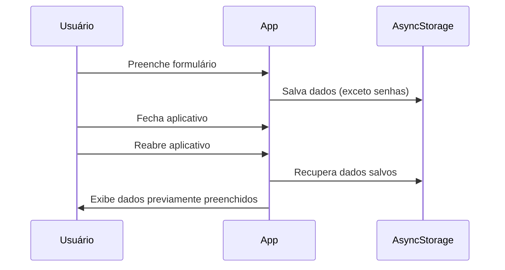

# KarsIV - Sistema de Cadastro

## Funcionalidade de Persistência de Dados

### Descrição
A tela de cadastro agora mantém os dados do usuário persistentes localmente, mesmo que o app seja fechado. Os seguintes dados são salvos automaticamente:
- Nome completo
- E-mail
- CEP
- Endereço completo

**Observação:** Por segurança, as senhas não são armazenadas localmente.

### Tecnologia de Persistência
**AsyncStorage** (do pacote `@react-native-async-storage/async-storage`)

**Justificativa da escolha:**
- Solução oficial recomendada pela comunidade React Native
- Compatível com iOS e Android
- Armazenamento chave-valor simples e eficiente
- Persistência garantida mesmo após fechar o app
- Performance adequada para pequenos volumes de dados

### Como Testar
1. Preencha os campos do formulário (exceto senhas)
2. Feche o app completamente
3. Reabra o app e navegue para a tela de cadastro
4. Verifique se:
   - Os campos preenchidos anteriormente estão mantidos
   - O endereço correspondente ao CEP continua carregado
   - As senhas estão vazias (como esperado por segurança)

### Fluxo Esperado

```mermaid
sequenceDiagram
    Usuário->>App: Preenche formulário
    App->>AsyncStorage: Salva dados (exceto senhas)
    Usuário->>App: Fecha aplicativo
    Usuário->>App: Reabre aplicativo
    App->>AsyncStorage: Recupera dados salvos
    App->>Usuário: Exibe dados previamente preenchidos
```
